# Instalación y configuración

Cura es un software abierto (Open software) desarrollado por Ultimaker que permite transformar modelos 3D en instrucciones entendibles por la mayoría de impresoras 3D, permitiendo generar un objeto físico a partir de su modelo 3D generado por ordenador.

Mientras que se decide la posición y la configuración de la impresión, el motor de
Cura prepara su modelo en segundo plano para así obtener el gcode lo más rápido posible.](http://www.zonamaker.com/impresion-3d/software-imp3d/manual-de-cura):

Descargar el paquete de instalación de la última versión de CURA correspondiente a vuestro sistema operativo de la página oficial de  [Ultimaker](http://software.ultimaker.com/).

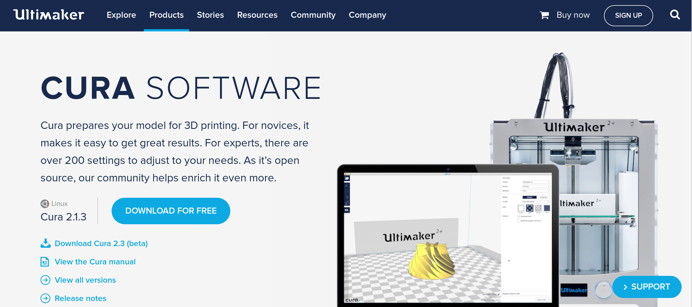

El programa provee de herramientas para llevar un archivo tridimensional, en formato [STL](https://es.wikipedia.org/wiki/STL), hasta nuestra impresora de una forma muy sencilla.

El programa permite generar G-Codes de piezas de gran tamaño, piezas con paredes muy delgadas así como modificar el tamaño y orientación de las piezas mediante una interfaz que muestra los modelos en 3D.

Al instalar el programa se pueden configurar ciertos aspectos de la impresora.

[STL](https://es.wikipedia.org/wiki/STL)

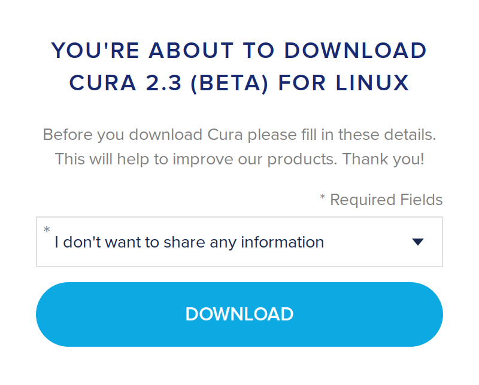

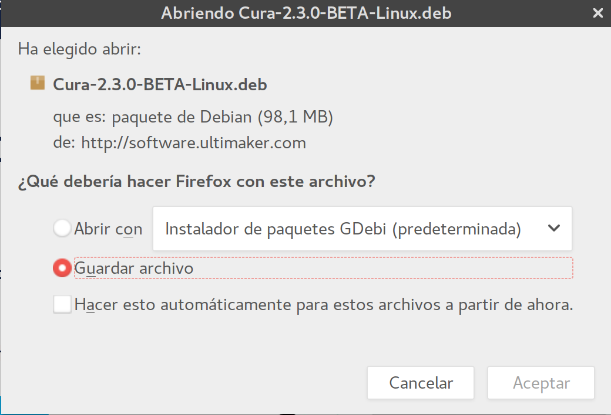

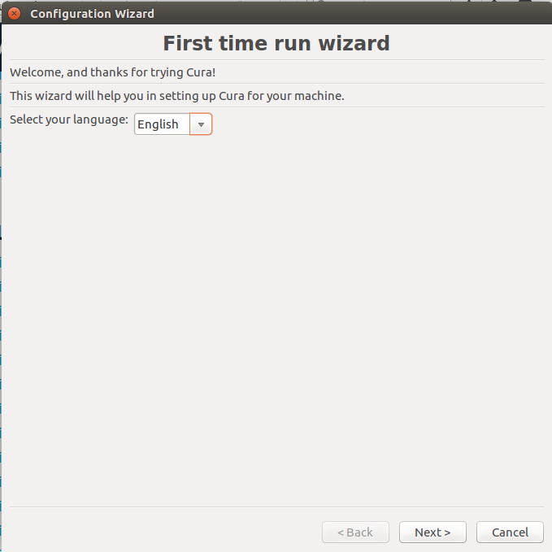

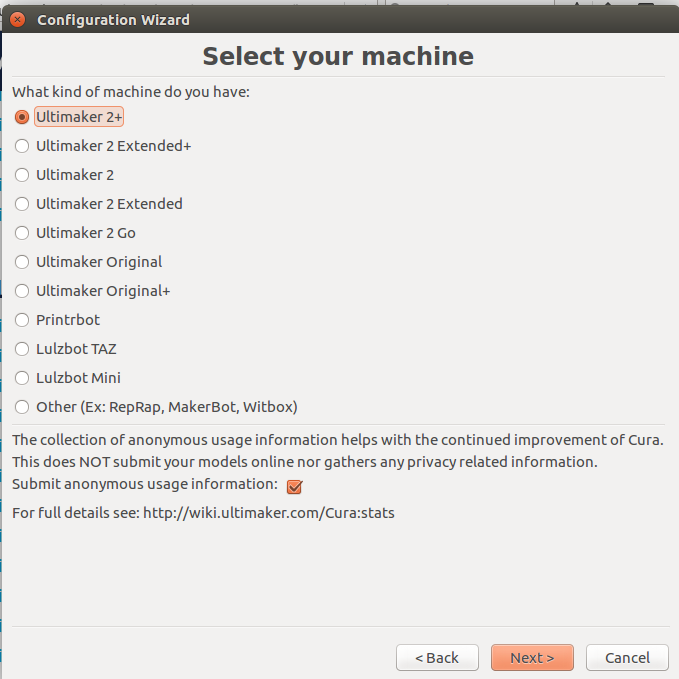

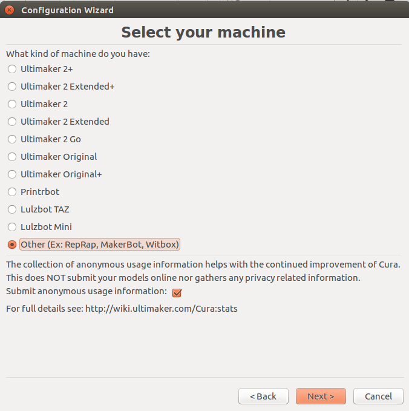

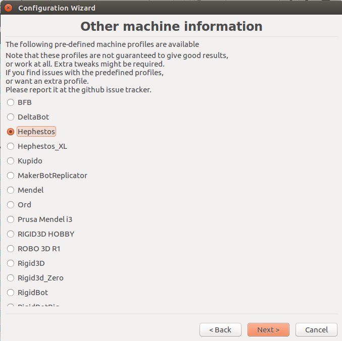

En GNU/Linux (Ubuntu 16.04.1) es recomendable utilizar la versión 15.04.6 a la versión 2.3.0 BETA.

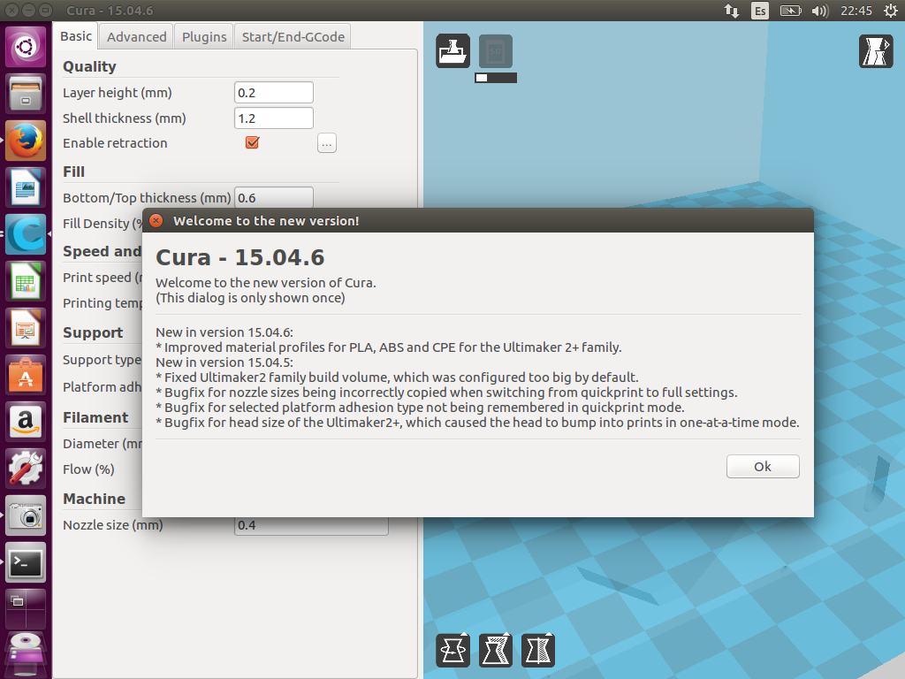

## ENTORNO DEL PROGRAMA

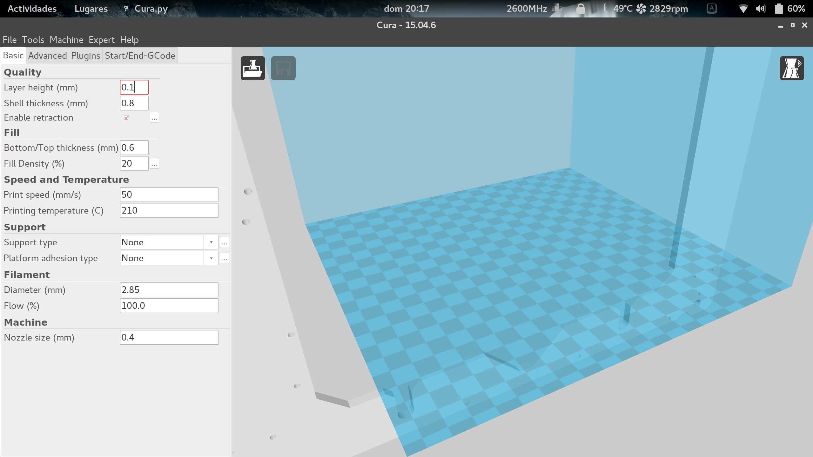

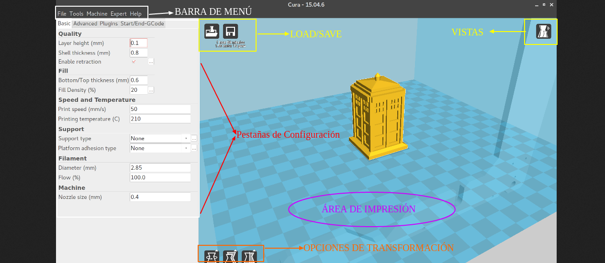

El área de impresión es una representación del volumen de impresión configurada con las dimensiones y límites de la máquina, permite ver la figura dentro de distintos tipos de impresoras.

### LOAD/SAVE

* Load:Abre o carga el modelo 3D que se desee imprimir, pero también se puede arrastrar y soltar el archivo dentro del área de impresión.

* Save:Guarda el archivo Gcode.

### VISTAS

En este icono se despliegan 5 nuevos tipos del área de impresión, permitiendo analizar los objetos que se van a imprimir, son las sigientes:

* Normal:Muestra la figura tal como se abre.

* Overhang:Realza la zonas que tienen un ángulo superior al ángulo que tengamos configurado. Resaltando así las zonas que pueden causar fallos a la hora de imprimir y determinar si es necesario soporte o no.

* Transparent:Hace transparentes a los objetos de impresión, permitiendo ver a traves de ellos.

* X-Ray:Permite ver a través del objeto, mostrando las cavidades o elementos internos de la pieza a imprimir.

* Layers:Esta es la vista más útil de todas, permite ver el diseño por capas, según se va a imprimir. Permite observar las trayectorias que realizará la Impresora 3D y ver si hay alguna zona en la que el laminado de la pieza se hace cómo queremos o no.

## OPCIONES DE TRANSFORMACIÓN

Cuando se carga un objeto y se selecciona, aparecen en la esquina inferior izquierda los siguientes iconos.

* Rotate:Permite rotar el modelo en cualquiera de los tres ejes mediantes unas circunferencias que, pulsando en ellas, permite mover la pieza en dicho eje. También despliega dos opciones más.

* Reset:Para restablecer la posición de inicio.

* Lay flat:Permite apoyar el modelo por su parte plana.

* Scale:Permite modificar el tamaño del modelo 3D. El icono despliega un menú donde podemos aplizar un factor de multiplicación a la escala del objeto o bien indicar las medidas que quereamos que tenga el mismo.

* Reset:Deshacer los cambios aplicados.

* To Max:Escalar el tamaño máximo permitido por el área de impresión.

Podemos redimensionar de manera proporcional al objeto inicial o de un modo totalmente libre, dependiendo de la activación en la opción "Uniform Scale".

* Mirror: Permite realizar simetrías en los objetos.

* Mirror X:Simetría del objeto respecto del eje X.

* Mirror Y:simetría del objeto respecto del eje Y.

* Mirror Z:Simetría del objeto respecto del eje Z.

### BOTÓN DERECHO

Al seleccionar una pieza contenida en el área de impresión y hacer click con el botón derecho del ratón, aparece un menú desplegable con varias opciones.

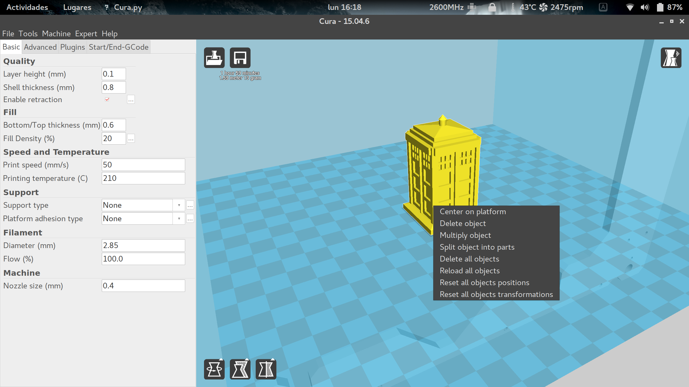

La opción **"Center on platform"** permite centrar el objeto en la plataforma de impresión. **"Delete object"** permite borrar el objeto. **"Multiply object"** permite multiplicar el objeto. **"Split object into parts"** permite dividir el objeto en partes. **"Delete all objects"** permite borrar todos los objetos de la plataforma de impresión. **"Reload all objects"** permite cargar y restaurar todos los objetos borrados.

La opción **"Multiply objects"** nos permite crear copias idénticas de un objeto sin tener que cargarlo varias veces, tán solo hay que indicar el número de copias que se desea del objeto y aparecen ordenadas en la superficie de la impresión. 

# PESTAÑAS DE CONFIGURACIÓN: MODO BÁSICO

### TOLS

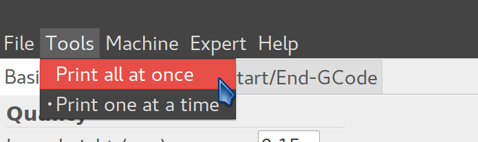

En la pestaña "tools" podemos encontrar 2 opciones que van a cambiar la forma en la que la impresora va a imprimir cuando tenemos múltiples objetos en el área de impresión.

Cuando situamos varios objetos en el área de impresión, por defecto los va a imprimir todos a la vez **("print all at once")**, pero podemos configurar la impresora para que imprima estos objetos de uno en uno, para ello hay que marcar la opción **("print once at time")**. Con esta opción marcada, la impresora hará cada objeto de manera independiente, comenzando un objeto siempre que haya terminado el anterior, esta es una buena opción para impresiones largas con múltiples objetos, ya que si en algún momento falla la impresión puede que tengamos algún objeto completo y no tengamos que desechar la bandeja entera.

### MACHINE

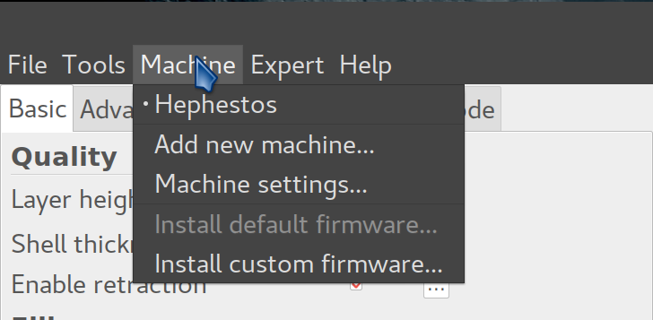

En la pestaña machine podemos tener varias configuraciones preestablecidas si tenemos varias máquinas que usan configuraciones diferentes. Al imprimir con una u otra máquina, tan solo debemos de seleccionar aquí la máquina que estemos usando y se cargaran los valores que tenemos guardados por defecto.

También podemos encontrar un acceso a **("Machine settings")** que nos llevará al mismo menú que **("file/Machine_settings")**

Este menú también da la opción de cargar un firmware especifico a la impresora **("install custom firmware")**.
 
### EXPERT

En la pestaña "Expert", las dos primeras opciones que nos encontramos nos van a permitir conmutar el modo en que aparecen las opciones de impresión entre una **("impresión rápida")** (sin apenas configuración) y una **("impresión completa")** (con todas las opciones). En la impresión rápida, tan solo hay que introducir la calidad que queremos obtener, el tipo de filamento que estamos usando y su diámetro, mientras que en la opción completa, aparecen todos los parámetros que afectan a la impresión.
*Es recomendable utilizar la configuración completa, ya que esto permite adaptar los parámetros de impresión a cada máquina.*

Si una vez arrancado Cura, seleccionamos **"Expert"** de la barra de menús y elegimos la pestaña **"Switch to quickprint"** = **(Perfiles de impresión rápida)** La ventana del programa se muestra del siguiente modo:

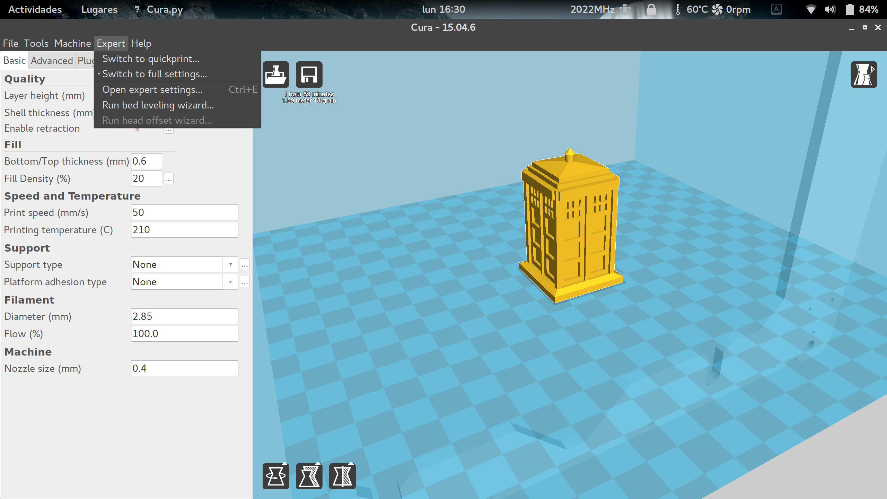

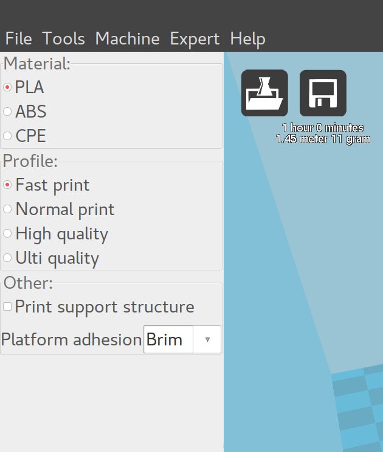

Estas opciones no nos permiten modificar los parámetros de impresión, sino sólo seleccionar unas configuraciones preestablecidas.

La siguiente opción **("Open Expert Settings")**, abrirá una ventana de configuración donde se pueden alterar parámetros de impresión que no aparecen en las opciones de impresión básicas.

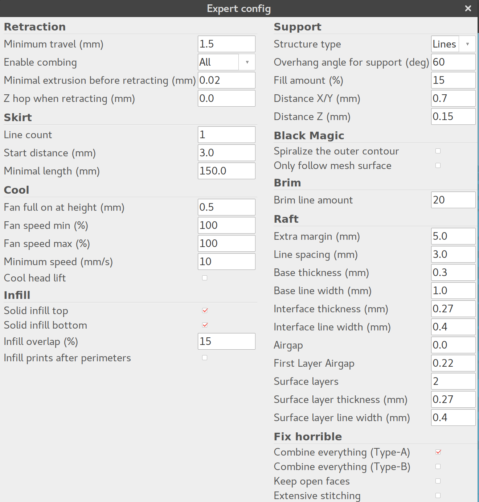

### RETRACTION (retracción)

La impresora hará la retracción del filamento siempre que tenga que moverse de un punto a otro sin imprimir. Esta retracción se realiza para evitar que gotee el plástico.

* Minimun travel (desplazamiento mínimo):Fija el desplazamiento mínimo para el que se realizará la retracción del filamento.
* Enable combining:Si esta opción está marcada, además de realizarse la retracción, la impresora va a evitar que el **HotEnd** pase sobre los orificios o huecos.
* Minimal extrusion before retracting (mínima extrusión antes de retraerse):Fija la cantidad mínima de plástico que se debe de extruir antes de realizar la retracción. Si no se extruye al menos esta cantidad de filamento, la retracción será ignorada.
* Z hop when retracting (elevación del eje Z al retraer):Esta opción hace que se eleve el eje Z cuando se realizan desplazamientos. Es una opción muy útil y que va a mejorar la calidad de piezas que tengan detalles pequeños, evitando junto con la retracción que aparezcan hilos que afeen la impresión. Para piezas simples recomiendo tenerla desactivada (ya que activarla va a incrementar el tiempo de impresión), si la pieza es compleja y tiene detalles, se puede introducir en este parámetro una altura que sea el doble de la altura de capa que se esté usando.

### SKIRT

El skirt o falda es una línea que va a rodear el modelo que estemos imprimiendo. Esta línea tiene 2 propósitos, el primero es determinar los límites donde estará contenido el modelo y el segundo es limpiar el **HotEnd** eliminando posibles burbujas de aire de su interior o suciedad de la propia boquilla.

* Line count, (Número de líneas):Fija el numero de vueltas que dará rodeando al objeto.
* Start distance (Distancia al objeto):Establece la distancia de separación entre el objeto y la falda.
* Minimal length,(longitud mínima):Establece la longitud mínima que tendrá la falda. En piezas pequeñas la falda no será suficientemente grande para limpiar correctamente el **HotEnd**, por lo que se fija una distancia mínima, incrementando el número de vueltas hasta llegar a esta distancia.

### COOL

Los parámetros contenidos en "Cool" afectan a la forma en la que se va a enfriar la pieza, pudiendo modificar las opciones del ventilador de capa o los tiempos mínimos de impresión.

* Fan full on at height, (Ventilador activo a cierta altura):Esta opción va a activar completamente el ventilador de capa a partir de la altura seleccionada. Para las capas inferiores, el ventilador funcionará a una velocidad proporcional, estando siempre desactivado para la capa inicial.
* Fan speed min/max, (velocidad máxima y mínima del ventilador):Estos parámetros establecen la velocidad máxima y mínima del ventilador de capa. Dependiendo del ventilador instalado en la impresora, hay que regularlo para que el flujo de aire sea correcto, ya que un flujo excesivo enfriará la pieza demasiado rápido y puede hacer que aparezcan rajas en la pieza.
* Minimun speed, (velocidad mínima): Establece la velocidad mínima de impresión. Este parámetro es muy importante, ya que al imprimir a muy baja velocidad el plástico se va a recalentar demasiado deformando la impresión, por ello es necesario fijar una velocidad mínima para que esto no suceda. Este valor va a depender del tipo de filamento con el que estemos imprimiendo, para la mayoría de filamentos un valor de 10 a 15mm/s es suficiente.
* Cool head lift, (Sube para enfriar):Si esta opción esta seleccionada, va a elevar el **HotEnd** al completar una capa si no se ha cumplido el tiempo mínimo establecido para cada capa, dándole tiempo a enfriarse y separándose para no recalentar el plástico.

### INFILL

* Solid infill top/bottom, (relleno sólido superior e inferior):Al seleccionar estas opciones, tanto la capa inferior como la superior serán sólidas y no se verán afectadas por el factor de relleno que se tenga aplicado al diseño. Es recomendable tenerlas siempre activadas.
* Infill overlap, (solapamiento del relleno):Este parámetro controla la cantidad de relleno que se va a solapar con los bordes. El valor que trae por defecto (15%) funciona bien.

### SUPPORT

Los soportes son elementos que en muchas ocasiones son totalmente necesarios para imprimir el modelo, y en función de las características del mismo, habrá que modificar los soportes para que se adapten lo mejor posible al diseño y sean fácilmente retirables.

* Strunture type, (tipo de estructura):Podemos seleccionar entre dos tipos de estructuras, una compuesta por una cuadricula **(grid)** y otra compuesta por líneas **(lines)**. Elegid la que mejor se adapte a vuestro modelo, aunque la estructura **"grid"** da por lo general mejores resultados.
* Overhang angle for support, (ángulo máximo para suportes):Indica el ángulo máximo para el que se empezarán a usar los soportes. Este ángulo toma como referencia la vertical, tenido un muro vertical un ángulo de 0⁰ y un puente horizontal un ángulo de 90⁰. La mayoría de impresoras son capaces de crecer con ángulos de al menos 45⁰, por lo que los soportes no son necesarios para ángulos inferiores. Fijad el valor en 45⁰ y aumentar el valor hasta determinar el límite de vuestra máquina.
* Fill amount, (Cantidad de relleno):Fija el relleno que se va a usar para los soportes. El relleno va a definir la separación entre las líneas de soporte, vuestra impresora deberá de crear puentes usando estas líneas y salvando estos huecos. Suelen funcionar bien valores de relleno del 20% al 50% (en función del diseño).
* Distance X/Y, (Distancia X/Y):Establece la separación entre los bordes del objeto y los soportes. Si esta distancia es muy pequeña, se pueden unir los bordes con los soportes haciendo que los soportes sean muy complejos de retirar y afeando la terminación final de la pieza. Una separación de 0.7mm será suficiente para **HotEnds** con boquillas de hasta 5mm.
* Distance Z, (Distancia Z):Establece la separación en Z (altura) que habrá entre el soporte y la pieza. Esta distancia está determinada en gran medida por la altura de capa que se use, siendo lo más correcto introducir aquí un valor que sea la mitad de la altura de capa. Los valores 0.1mm o 0.15mm funcionan bien.

### BLACK MAGIC

* Spiralize the outer contour:Esta opción imprime el contorno del objeto con una base sólida. Convierte un elemento sólido en un objeto hueco.
* Only follow mesh surface:Esta opción imprime la superficie o cáscara del objeto, sin que se tengan en cuenta la base, el relleno o la capa superior.

### BRIM

* Brim line amount, (Ancho de la visera):En este parámetro se indica el ancho que va a tener la visera. Cuanto mayor sea el ancho de la visera, mayor va a ser la adhesión que tendrá el objeto. El tamaño de la visera va a depender de la superficie de contacto y de la forma que tenga la pieza, siendo valores comunes los que están comprendidos entre 5 y 20 milímetros.

### RAFT

Aquí podemos configurar todos los parámetros de la base de impresión. Esta base, como se comentó en la "configuración del laminado", va a mejorar la adhesión de la pieza creando una especie de malla sobre la que se imprimirá el objeto.

* Extra margin, (Margen extra):Este parámetro fija el margen que sobresaldrá la base del objeto.
* Line spacing, (Espacio entre líneas):Fija la distancia entre las líneas que formaran la malla.
* Base thickness, (Espesor de la base):Establece el espesor que tendrá la base. Por defecto se suelen hacer 1 ó 2 capas de base (en función del espesor de capa).
* Base line width, (Ancho de la línea de base):Este parámetro modifica el grosor de las   líneas con las que se confecciona la base. Da buenos resultados usar líneas que tengan el doble de ancho que la boquilla del **HotEnd** (dará dos pasadas por línea).
* Interface thickness, (Espesor de la capa intermedia):Establece el grosor de la capa intermedia que tiene la base.
* Interface line width, (Espesor de la línea intermedia):Establece el grosor de las líneas que forman la capa intermedia de la base.
* Airgap:Este parámetro modifica el espacio entre la última capa de la base y la primera capa del objeto. Esta separación va a influir en la facilidad a la hora de retirar la base del objeto.
* Surface layers, (capas de la superficie):Fija el número de capas de la parte superior de la base.

### FIX HORRIBLE

Las opciones incluidas en **("Fix horrible")** son opciones para intentar mejorar o reparar los objetos. El programa por defecto realiza modificaciones en el diseño 3D que puede dar como resultado efectos no deseados y que alteren el modelo original. Las opciones contenidas en **("fix horrible")** por si solas o combinadas entre sí, cambian la manera en que CURA va a interpretar el modelo 3D, solventando posibles problemas a la hora de imprimir.

Por defecto CURA suele reparar correctamente todos los errores del modelo 3D, estas opciones solo son recomendables activarlas en casos excepcionales, ya que pueden afectar negativamente a la impresión.

* Combine everything, (Type A):Une todas las partes del modelo en base a las normales intentando mantener los orificios internos intactos.
* Combine everything, (Type B):Une todas las partes del modelo ignorando orificios internos y conservando la capa exterior.
* Keep open face:Mantiene abiertos pequeños huecos que pudiera tener el modelo. Por defecto CURA cierra los huecos o grietas pequeñas del modelo, ya que los toma como errores del diseño.
* Extensive stitching:Repara los agujeros o grietas del modelo, cerrando los orificios que tengan polígonos que se toquen.

Las dos últimas opciones que podemos encontrar dentro de la pestaña **("Expert")** son:

* Run head offset wizard:Con esta opción podemos ejecutar el asistente para la configuración inicial. Este asistente se ejecuta por defecto la primera vez que instalamos el programa
* Run bed leveling wizard:Al pulsar esta opción, se va a ejecutar un asistente que ayuda en el proceso de nivelación de la cama.

## MENÚ DE IMPRESIÓN

Una vez cargado el modelo en el área de impresión y configurado los parámetros de laminado, podemos guardar estos valores en la tarjeta SD e imprimir la figura usando para ello la pantalla LCD de la impresora 3D o bien podemos establecer una conexión entre la impresora y el ordenador abriendo para ello el menú de impresión.

Podemos abrir el menú de impresión pulsando sobre el icono "print with USB" que encontraremos en la parte superior del área de impresión o haciendo clic sobre la opción "print" que está dentro del menú "file" de la barra de tareas.

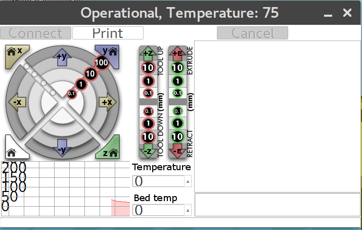

Al hacer esto se nos abrirá una nueva ventana con el menú de impresión. Esta ventana puede mostrar dos entornos visuales distintos en función de la configuración que tengamos (ver "preferences"), puede mostrar la vista básica de CURA o cargar el entorno de pronterface.

En ambos entornos de impresión vamos a encontrar las mismas opciones, mover los ejes en todas direcciones, extruir, fijar la temperatura tanto de la cama caliente como del HotEnd y visualizarla en el monitor de temperaturas. Cuando la impresora tenga la temperatura deseada y tengamos todo listo, tan solo hay que hacer clic sobre el botón "print" para que comience la impresión. 

